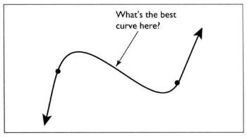
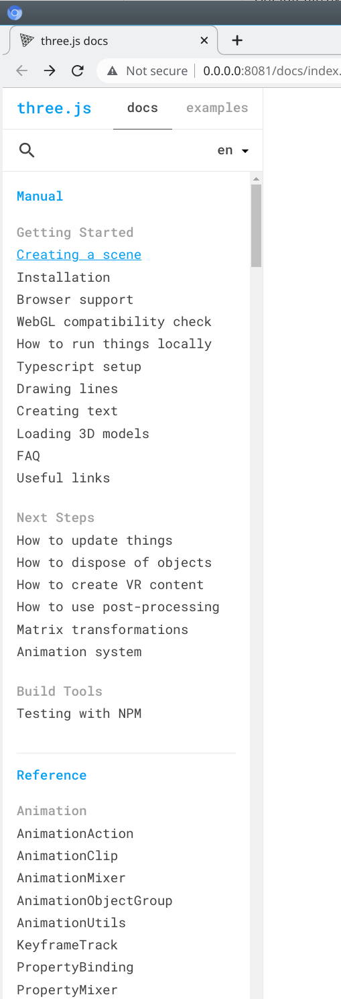

### A Design Challenge: The Need for CAGD

When creating products and artwork, designers face tasks such as this:  You are given two points in a plane and two directions associated with the points.  Find the curve that passes through the points that is tangent to the given directions. 

This is a simple pencil-and-paper task for anyone who is familiar with parametric forms, the types of curves used in CAGD.

CAGD tools are meant to be

* intuitive
* simple to use

Sometimes the mathematics underlying the tools becomes quite sophisticated, yet the result is meant to be easily understood and geometrically intuitive.

The technical person often benefits from these intuitive and visually related tools when considering deeper mathematical problems.  The geometry of CAGD is very amenable to visual demonstration.

### Exercise 1.3 ###

You will need to refer to the three.js API documentation for version r124 a lot.  Since https://threejs.org has the latest documentation, it might differ from the documentation for r124.  So you'll need a local copy of r124 to refer to.

1) Clone three.js from https://github.com/pflagerd/three.js

2) `git checkout r124`

3) If you haven't already, install nodejs from https://nodejs.org

4) Open a bash shell, and `cd three.js`

5) `npm i http-server -g`

6) `http-server -o docs/index.html`

7) You will see a browser open with the reference doc available:

   

8) Use ^F to search the Reference docs for the word "points".

9) Show your findings to your tutor, and explain how you might use what you found.