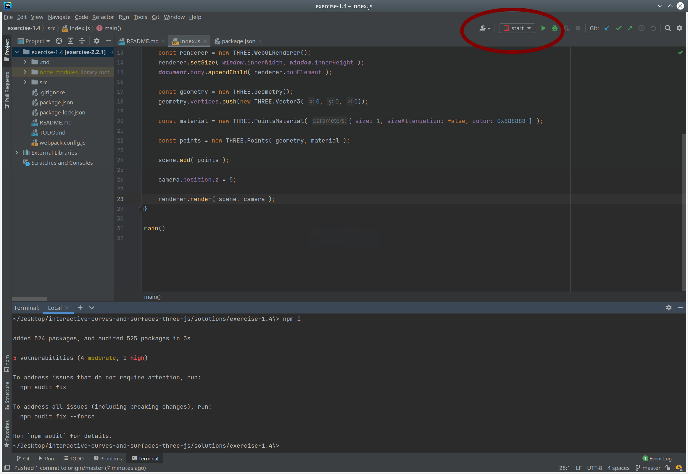
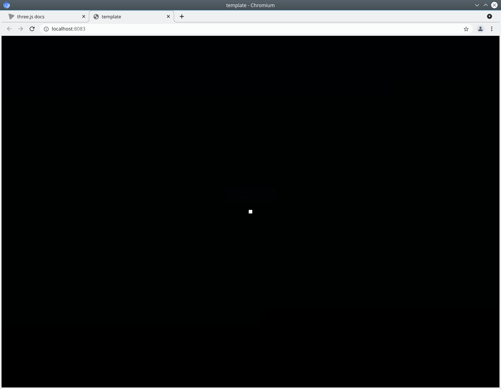
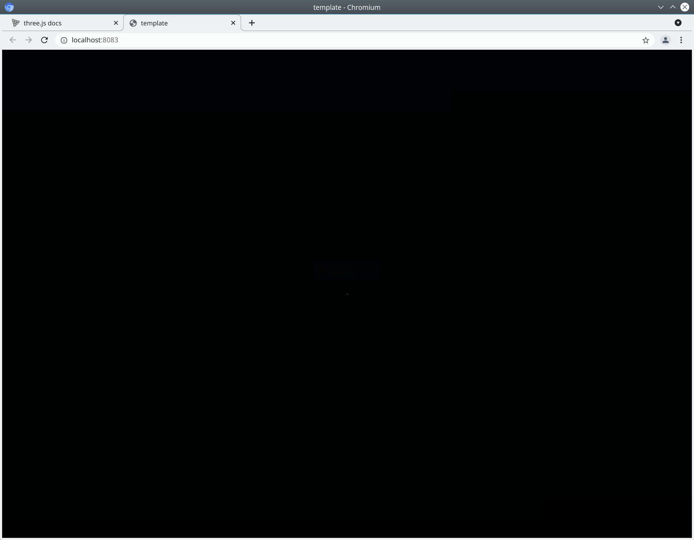

### CAGD: From Points to Teapots

There is a natural progression of the geometry behind CAGD.  With small incremental steps, it is possible to describe complex objects in terms of simple primitives such as points and lines.

### Exercise 1.4

While we usually encourage you to consult the solutions only after you have tried the exercise yourself, in this exercise we want you to become familiar with how to run the solutions.

1) Navigate to the directory solutions/exercise-1.4

2. If you are in Webstorm, it might detect that you haven't yet run `npm install`. If it prompts you, you should allow it to run.

3. Webstorm may also detect webpack, and prompt you to let it initialize webpack using webpack.config.js

4. There is an abbreviation for `npm install` which is `npm i`. If you haven't done so already, from a terminal execute `npm i`.

5. Now figure out how to create a launch configuration for `npm start`.  If you are using Webstorm , you should end up with a launch config like this:

   

6. Use your new launch configuration to launch the exercise.

7. You should see a window with a black background and a single square in the exact center of the window.  The square is actually a point of size 10px.

   

8. In the code, find `size: 10, `and change it to `size:1,` You should see something like this (the tiny point is barely visible).

   

   

