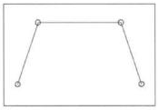
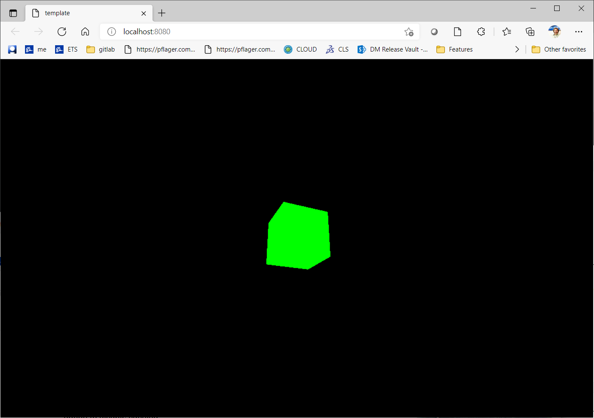

### Control Points: The Start of CAGD

Take four points in a plane and connect them to form a polygon.  The four points may be called *control points*, in that they *are points in two or more dimensions that define the behavior of the resulting curve*.  The polygon formed by connecting the control points in the "correct" order are called the *control polygon*.  The control polygon provides a crude analogy of the refined curve.  Note that the control polygon is typically open (the ends are not coincident), and it may self-intersect.  The control points and the control polygon determine the approximate shape of the curve to be formed.

#### Exercise 1.5.1

In this exercise, you'll create an application  in threejs using `template/` as a starting point.

1. Follow the detailed instructions in `template/README.md` describing how to create a new application using `template/` as a starting point.
2. Make sure to read the code.  You'll want to keep the threejs documentation for r124 handy.  Look up the classes and methods as you read.  There's no faster way to learn threejs.
3. After completing the instructions you should see a black screen with a sort of rotating cube that looks like this:

4. Now turn off the animation.
5. Show the result to your tutor.

5. Remember when you searched the three.js documentation for "point"?  If you were paying attention, you will have seen an example where 10000 points were displayed, creating a sort of starscape. Comment out the code that created the cube and replace it with the code for the starscape.

6. You should see something like this when you're done:

   

7. Show your tutor.

#### Exercise 1.5.2

In this exercise, you're going to draw a line.  Lines are part of what you're going to need to draw the little four-control-point image at the top of this page.

1. Write an application in threejs using `template/` as a starting point.
2. Draw a single black line on a white background something like this:
3. asdf
4. Now draw two more lines so that you see something like this:
5. asdf
6. Now draw a circle of radius 1 something like this:
7. asdf
8. Now change its radius so it is the size of the circles on the little four-control-point image at the top of this page.
9. asdf
10. Now position its center so that it looks like this:
11. asdf
12. Now add a second circle like this:
13. asdf
14. And finally draw a rectangle around it all like this:
15. asdf
16. Show your tutor

#### Exercise 1.5.3

In this section you're going to make your drawing object-oriented (if you haven't already).  You should have a class for a Line, a Circle and a Rectangle.  These should not conflict with anything of the same name in three.js

1. Create a Line class
2. Create three instances of the class, one for each of the three lines from 1.5.2
3. Create a Circle class
4. Create two instances of the class, one for each of the circles from 1.5.2
5. Create a Rectangle class
6. Create one instance of the class for the rectangle from 1.5.2
7. Your result should look the same as that of 1.5.2
8. asdf
9. Show your tutor your code and your drawing.