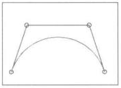

### A CAGD Favorite: The Bézier Curve

A special curve known as the *Bézier Curve* may be generated by the control points.  Notice that while the curve passes through the end-points of the control polygon, it only comes close to the other points.