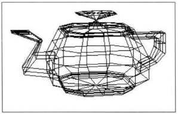

### Three-Dimensional Control Polygons for Surfaces (Control Meshes)

Bézier curves behave just as well in three dimensions as in two.  This image shows the control polygons for a three-dimensional object consisting of Bézier *Surface Patches*, also known as *Bézier Patches*.  A *Surface Patch* (aka *Patch*) is a bounded portion of a possibly infinite surface.  Stated a different way, a line segment is to a line as a surface patch is to a surface - kind of like a patch is cut from a piece of cloth. A *Bézier Patch* is formed by extruding a Bézier curve through space to form a surface patch.