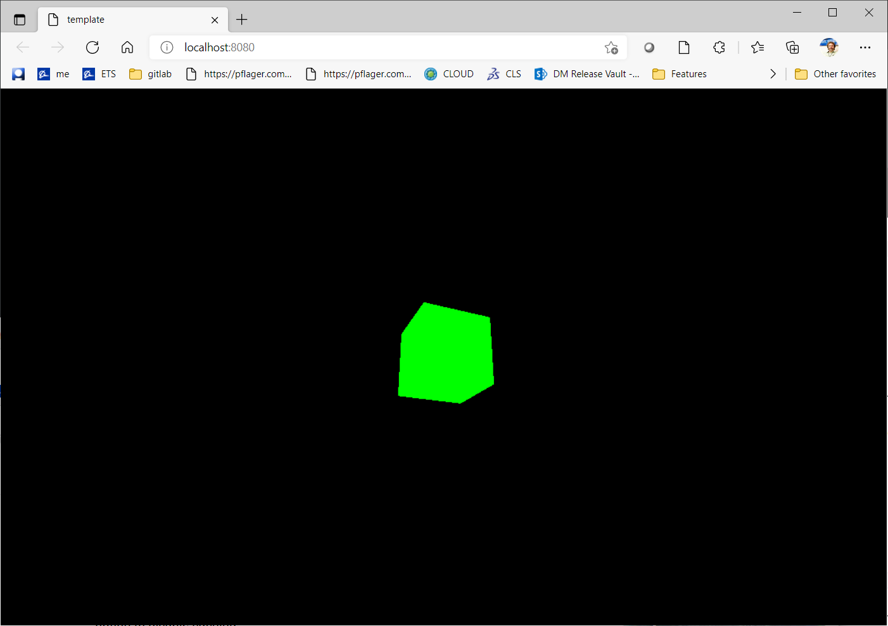

### What You Will Learn

* The basic math needed for the rest of the book,
  * An overview of parametric forms, a convenient way of describing curves and surfaces,
  * The idea of continuity, to ensure that curves and surfaces join together smoothly,
  * an illustration of linear interpolation, one of the most fundamental concepts in CAGD.

**Exercise 2.1**

Write an application in threejs using `template/` as a starting point.

There are detailed instructions in `template/README.md` describing how to create a new application using `template/` as a starting point.

Make sure to read the code.  You'll want to keep the [threejs manual](https://threejs.org/docs/index.html#manual/en/introduction/Creating-a-scene) handy.  Look up the classes and methods as you read.  There's no faster way to learn threejs.

If successful, you should see a black screen with a sort of rotating cube that looks like this:

Alternatively, you can consult `tutorials/Exercise 2.1` which explains how we did this exercise.

