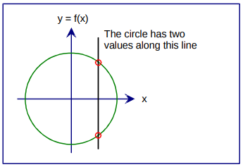
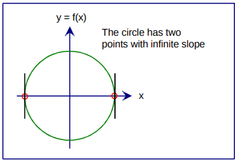

# The Parametric Curve

Typically, when a student takes mathematics, a curve is presented as a graph of a function $f(x)$.

As $x$ is varied, $y = f(x)$ is computed by the function $f$, and the pair of coordinates $(x, y)$ sweeps out the curve. This is called the *explicit* form of the curve.

From a design standpoint the explicit form is deficient in several ways:

* Single-Valued
  The curve is single-valued along any line parallel to the y axis. For example, only parts of the circle may be defined explicitly.

  

* Infinite Slope

  

  An explicit curve cannot have infinite slope; the derivative f' (x) is not defined parallel to the y axis. Hence there are two points on the circle that cannot be defined.

* Transformation Problems
  Any transformation, such as rotation or shear, may cause an explicit curve to violate the two points above.

The parametric form of a curve is not subject to these limitations. Moreover, it provides a method, known as *parameterization*, that defines motion on the curve. Motion on the curve refers to the way that the point $(x, y)$ traces out the curve .

Parametrization uses an independent parameter (aka variable) to compute points on the curve.  It gives the "motion" of a point on the curve.