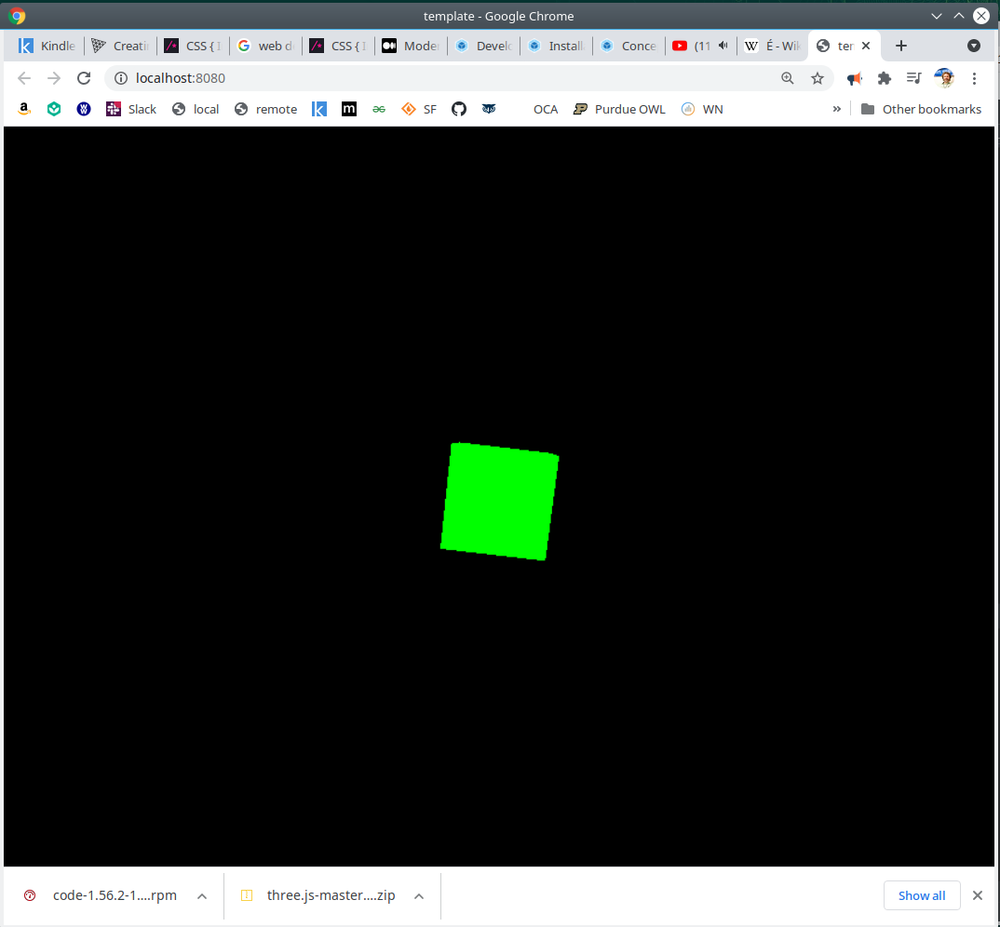

# The Workflow

```mermaid
graph TB
	start((start)) --> step1(1. Install Prerequisites)
	step1 --> step2(2. Copy this template/ and test the new instance)
	step2 --> step3(3. Modify the code and observe any changes)
	step3 --> step4{Done?}
	step4 -->|no| step3
	step4 -->|yes| stop((stop))
```

### 1. Install prerequisites

1. Install [node.js](https://nodejs.org).  We currently use v12.18.3.

   `sudo zypper install nodejs-common`

   or [try these options](https://stackoverflow.com/questions/7718313/how-to-change-to-an-older-version-of-node-js).

2. Optionally update [npm](https://www.npmjs.com/).  We currently use 6.14.6.

   `npm install -g npm@6.14.6`

### 2. Copy this template/ and test the new instance

1. Copy the entire `template/` directory to a new directory name

   `cp -r template/ demo/`

2. Add the new directory to git

   `cd demo/`

   `git init` 

   `git add .`

   `git commit -m "Initial"`

3. Install npm dependencies

   `npm i`

4. Launch the demo in a new browser session with a new webpack-dev-server.

   npm run start

5. Observe that you see a sort of rotating cubish thing:

   

6. Now you can start modifying the code.

NOTE: You can terminate the webpack-dev-server by typing ^C .  The browser instance will not terminate by itself though.

### 3. Modify the code and observe any changes

* There is a single source file called `src/index.js`. Webpack creates `dist/index.html` automatically based on instructions in `webpack.config.js` 
* `index.js` imports THREE from `node_modules/` and calls the function main().

* When you ran `npm run start`, webpack created `dist/index.html`, webpack-dev-server started serving `dist/` as the web root at localhost:8080, and webpack spawned a browser window at localhost:8080.  
  Thereafter, webpack-dev-server listens for any changes in the source tree and refreshes the browser contents automatically so you can see changes right away.

* It is really that easy!
