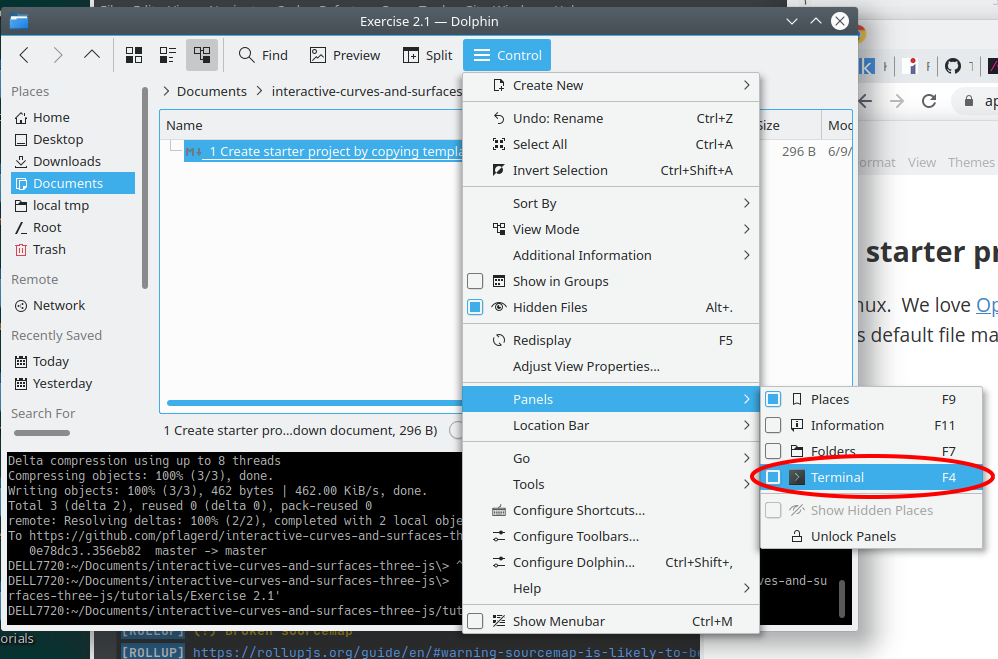
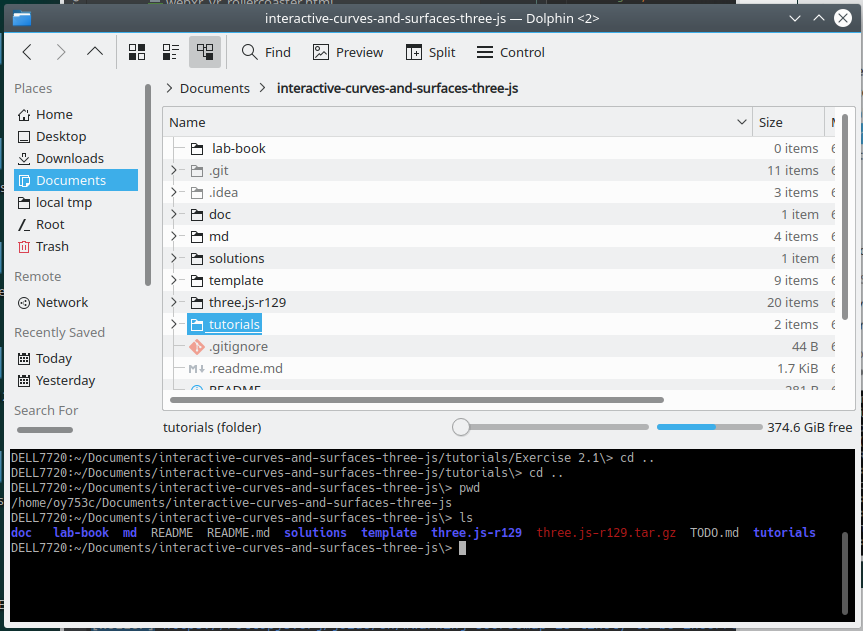
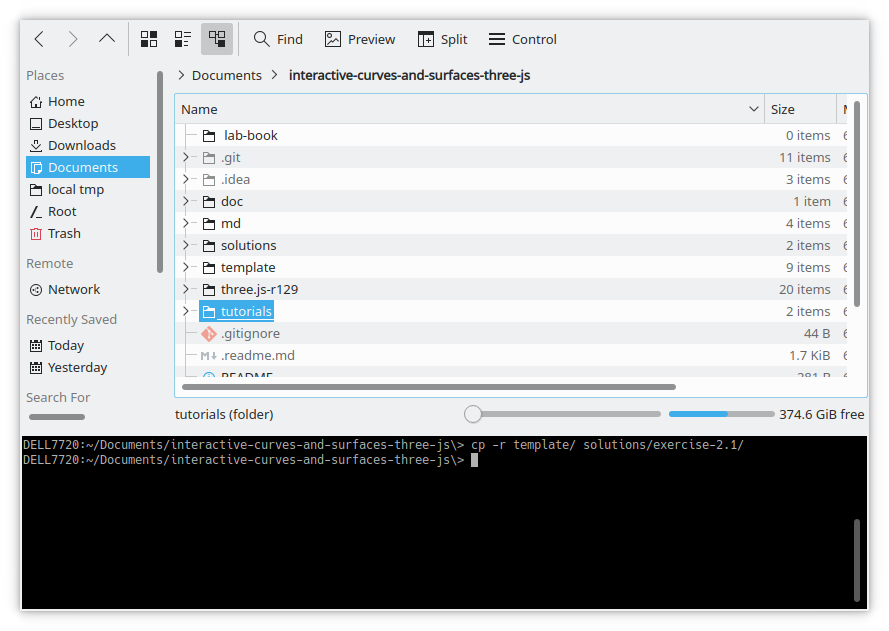
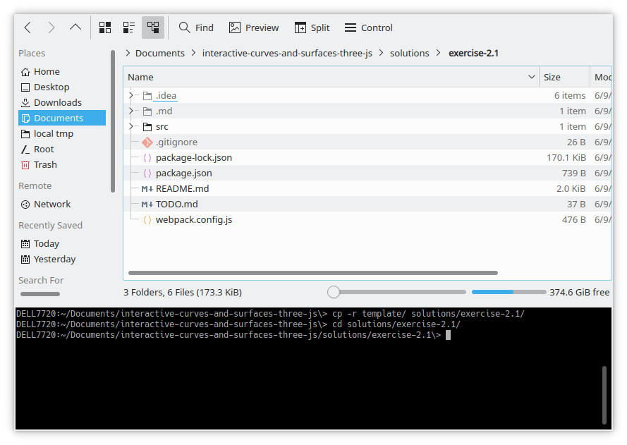
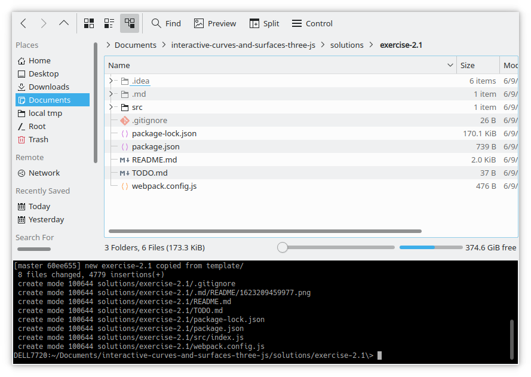
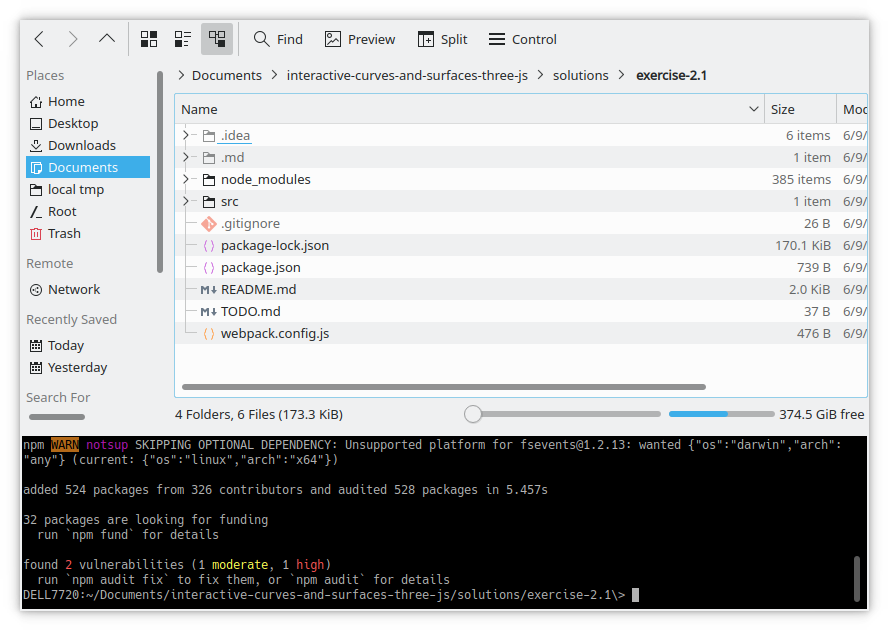
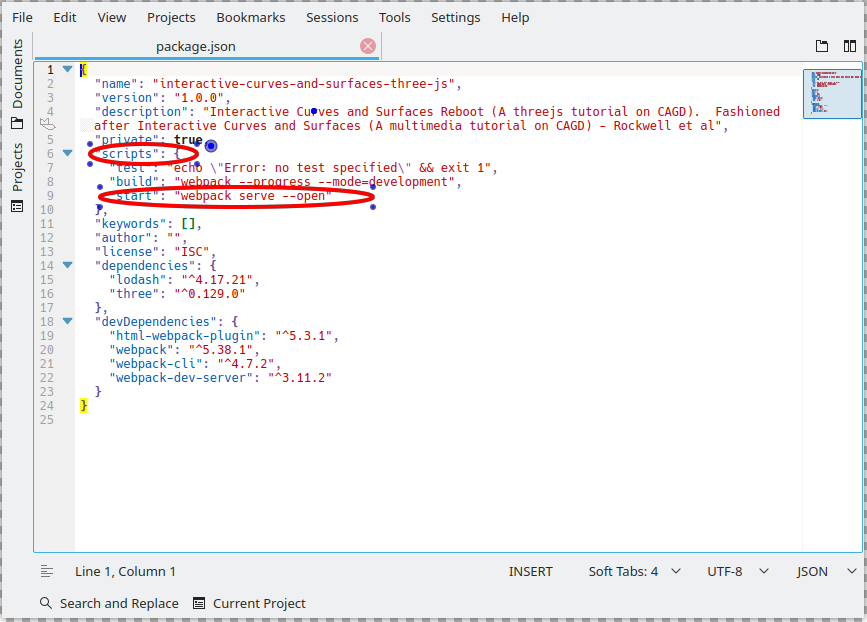
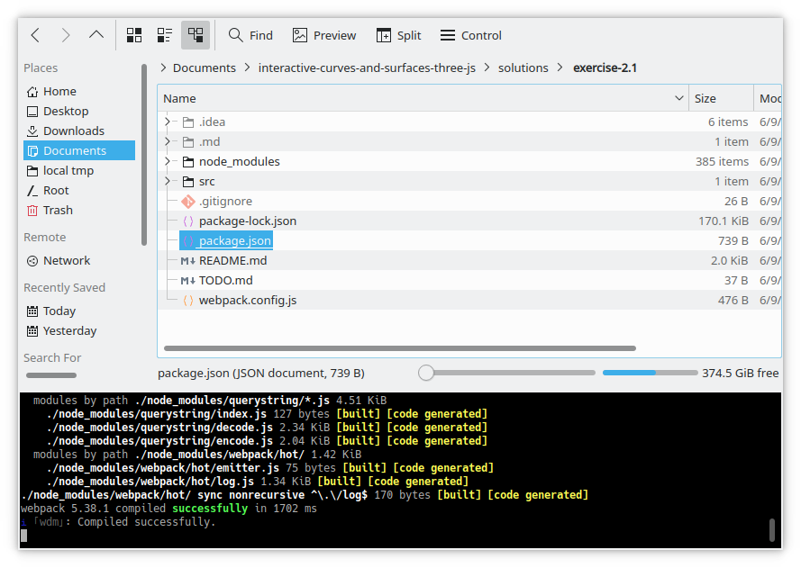
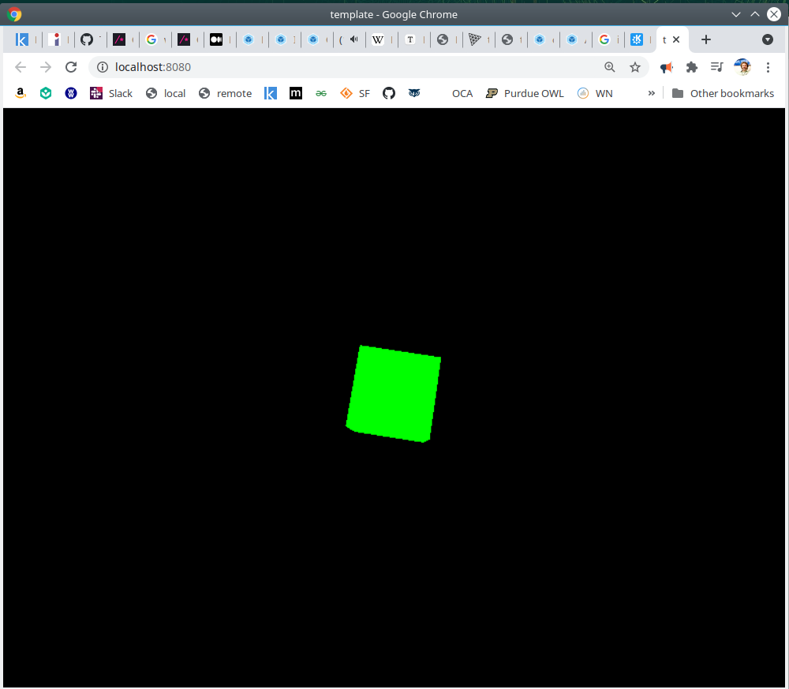

### Create starter project by copying template/ directory

We love Linux.  We love [OpenSUSE](https://www.opensuse.org/) Linux.  We love [KDE Plasma Desktop](https://kde.org/plasma-desktop/) (its default GUI) and we love [KDE Dolphin](https://apps.kde.org/dolphin/) (its default file manager).

With Dolphin, you can display files and a terminal at the same time.  Here's how to enable the terminal pane:

Now you should `cd` to the `interactive-curves-and-surfaces-three-js` project working directory.

If you do an `ls`, it should look something like this:

Now `cp -r template/ solutions/exercise-2.1/`:

Next, `cd solutions/exercise-2.1`, and notice that dolphin's file pane has changed to match the terminal's current directory:

Now `git add .` and `git commit -m"new exercise-2.1 copied from template/"`. Dolphin should look something like this:

Next, you'll need to install the new project's dependencies using `npm i`.  You'll see npm furiously installing files, after which it will look like something like this:

Now we test the new project by typing `npm run start`. This runs a *script* called *start* defined in `exercise-2.1/package.json`.  You can see `exercise-2.1/package.json` below.  We've highlighted the "scripts" section where you can see the start script (as well as two other scripts: test and build).

When you execute `npm run start`, npm actually executes `webpack server --open`.  This causes webpack to perform a build, which creates a virtual`index.html` and`index.bundle.js` in memory, which it then serves on `localhost:8080` using `webpack-dev-server`.  This should leave your Dolphin session looking something like this:

You should see a browser window open as well, which will look something like this (the cube should be rotating because it is animated):

If you get this far without problems, you're ready for the next topic.

