### Initializing the starter project using Webstorm

We love WebStorm.  So for the rest of this tutorial, we're going to use it exclusively.

In fact, we're going to redo some steps we did with Dolphin in Webstorm so you'll know how.

IMPORTANT: After making sure you've committed all your current files, from a terminal type `git clean -dfx`.  This will remove any untracked files, including node_modules from your project.  This is so Webstorm will detect that `npm i` needs to be run. 

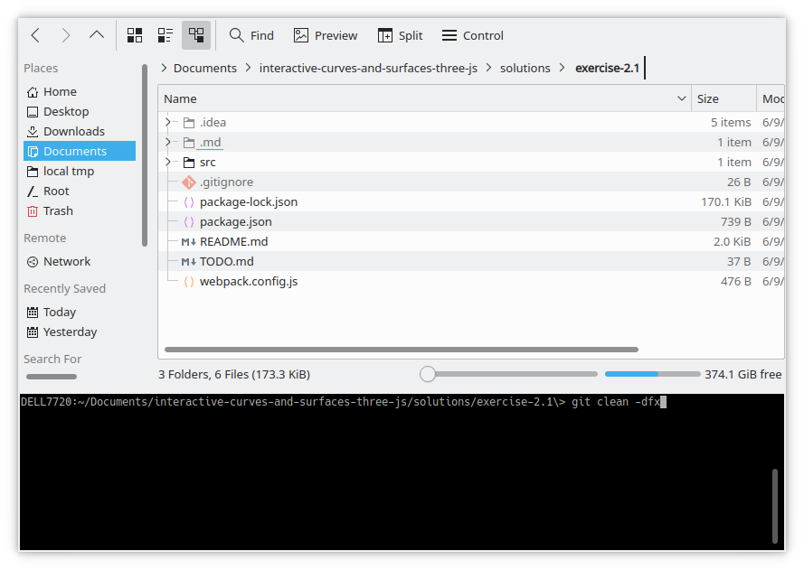

Now, launch Webstorm, and choose File > Open.

When the Open File or Project dialog appears, navigate to solutions/exercise-2.1:

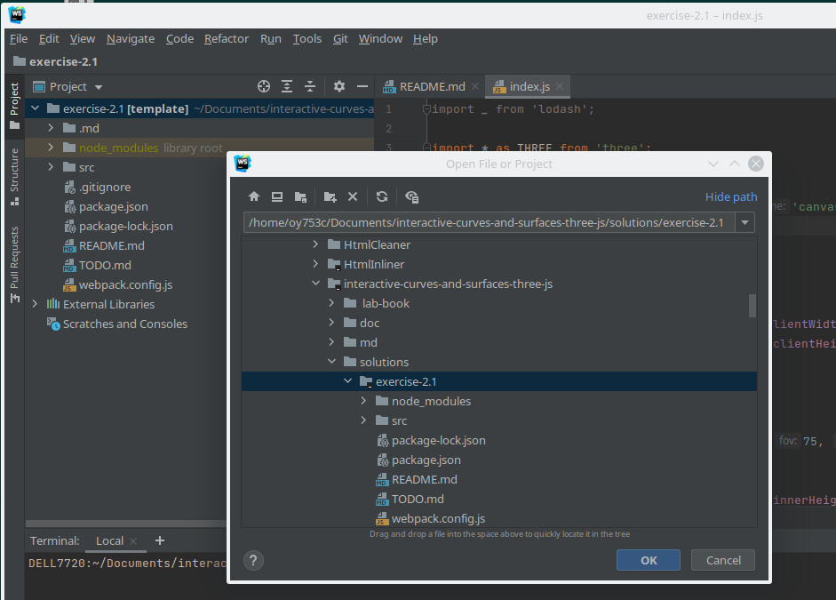

Press OK.

You will see the Open Project Dialog.  Choose This Window or New Window:

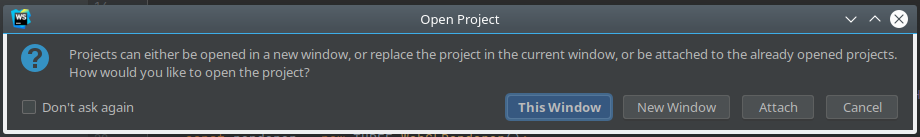

You should see something like this:

We want you to notice the "Install dependencies" notification in the lower right corner of the Webstorm window.

Click on the  link on the notification:

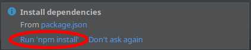

A new pane will open in Webstorm, and `npm install` will be executed in it.  When finished, Webstorm should look something like this:

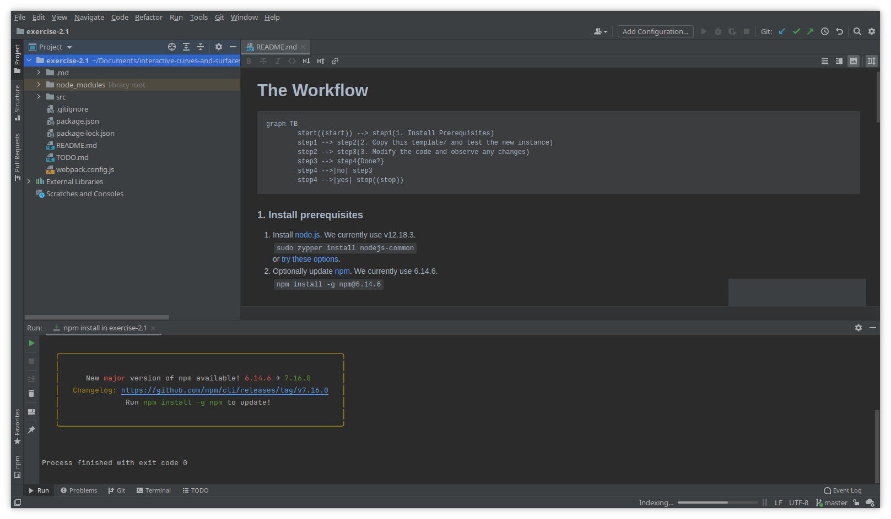

It turns out that Webstorm executed `npm install` in the "Run" pane.  There is another pane available to us, similar to the terminal pane in Dolphin.  It is called the Terminal pane, and you can activate it by clicking on the Terminal icon at the bottom of the Webstorm window:

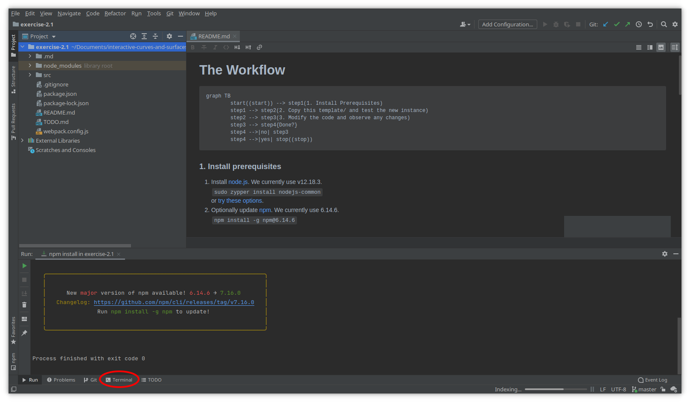

You should now see the Terminal pane (instead of the Run pane):

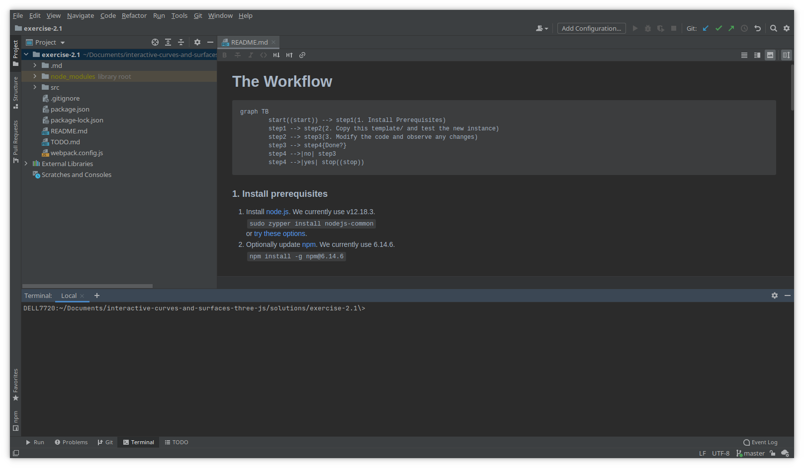

At this point, you could just type `npm run start`, but there's a more elegant way in Webstorm.  Click on ![1623277875981](.md/ 2 Create starter project by copying template directory/1623277875981.png as shown below:

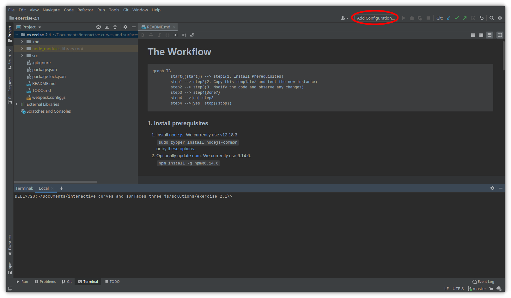

You should see the Run/Debug Configurations dialog thus:

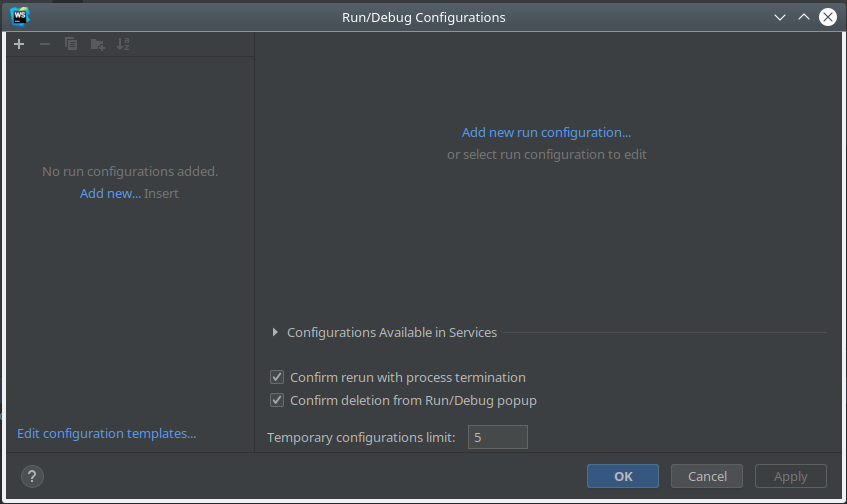

Click on either 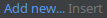or 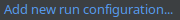as shown below:

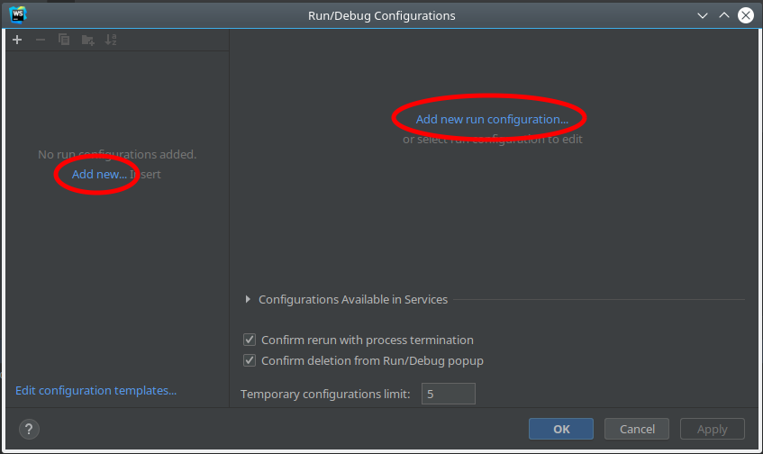

You should see the Add New Configuration drop-down list.  Choose npm as shown:

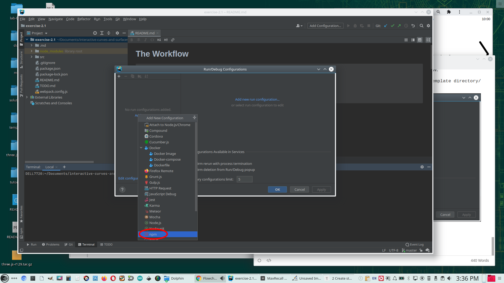

You should see the Run/Debug Configurations dialog again, but this time with quite a few more fields:

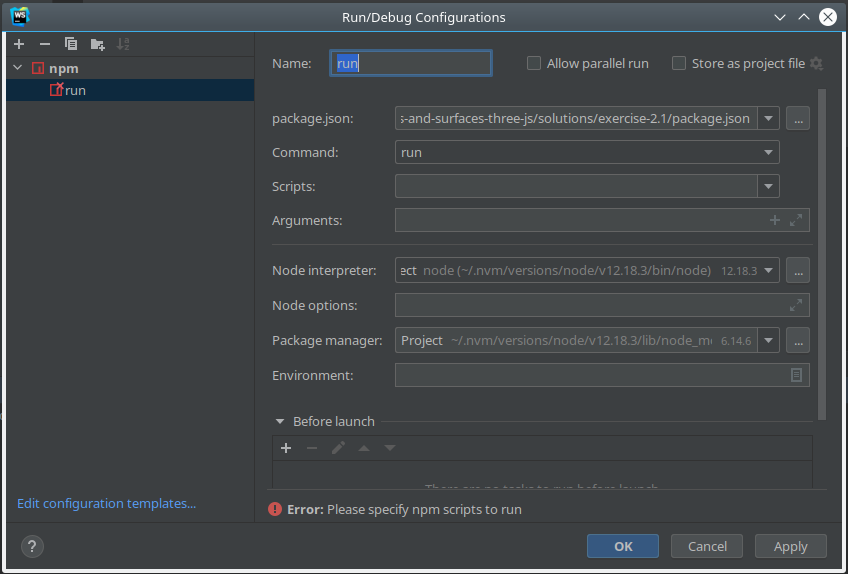

Change the Name field to start.  Then drop down the Scripts list, and choose start.  Webstorm got that right out of the package.json:

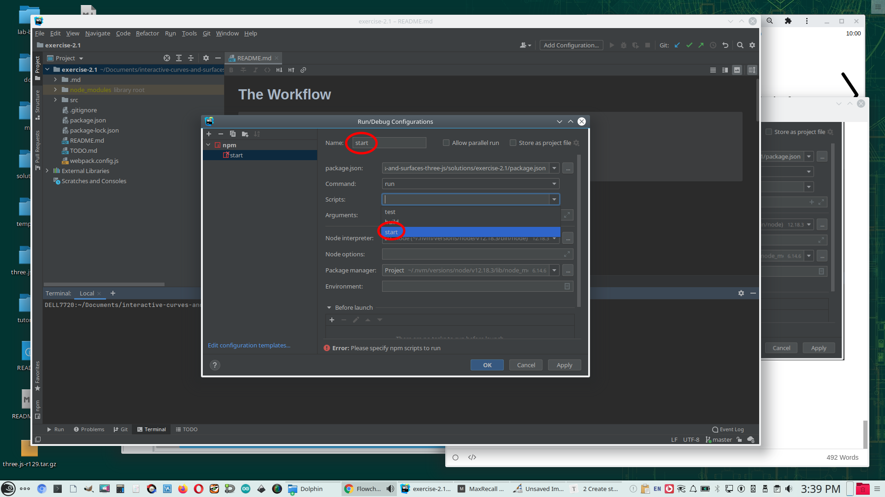

Now click OK, and 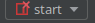 appears instead of Add Configuration:

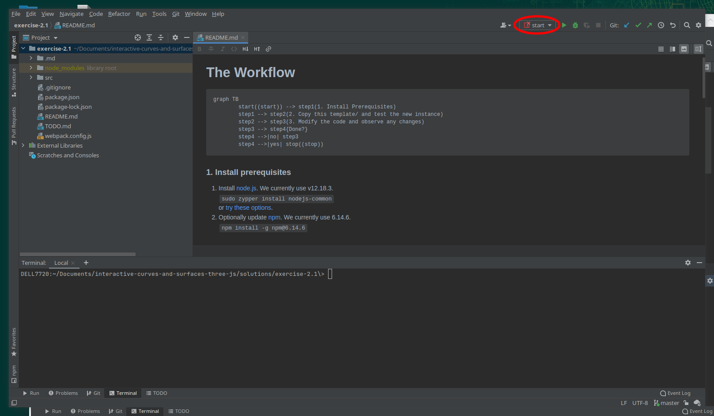

You may now execute `npm run start` by clicking on  just to the right of 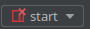:

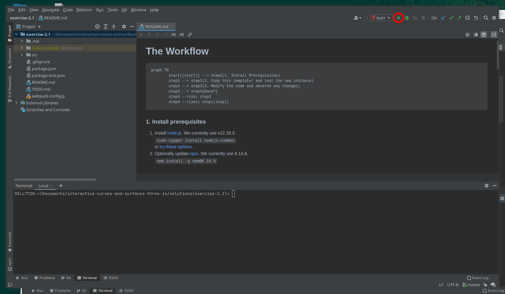

This will launch web-dev-server and spawn a new browser session.  You should be seeing something like this:

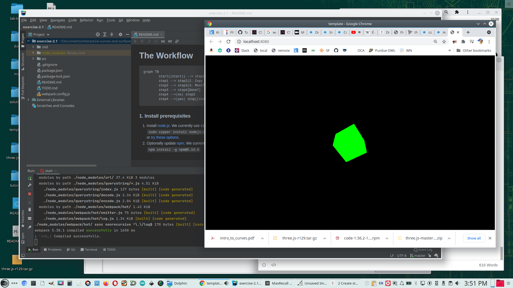

Please notice that `npm run start` is running in the Run: pane, which has replaced the Terminal pane in Webstorm.

