### Modify index.js to display a suitable background color

From Webstorm's project pane, locate and expand :

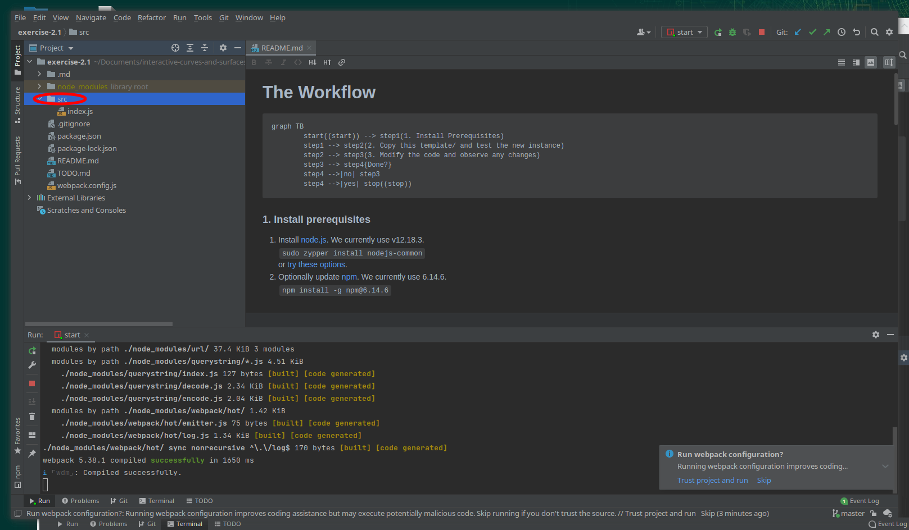

Now double-click 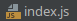to display `index.js` in the Webstorm editor.

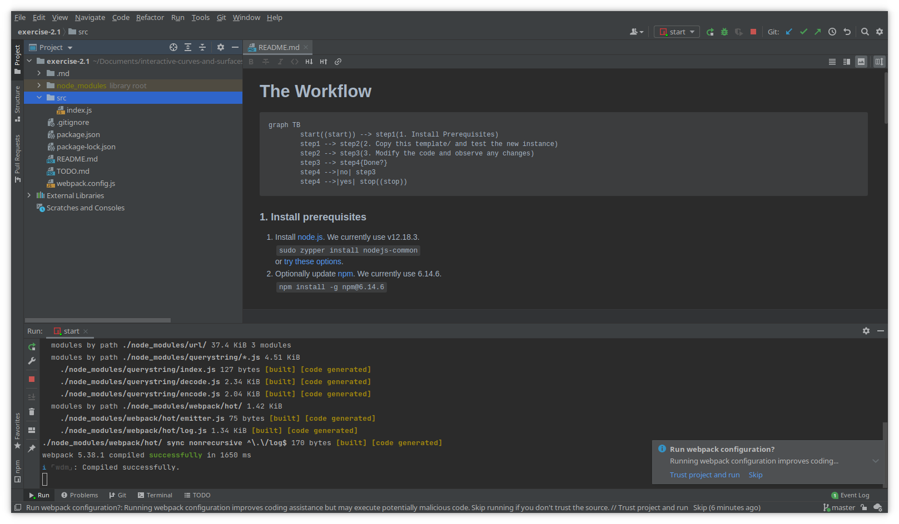

Notice the  dialog:

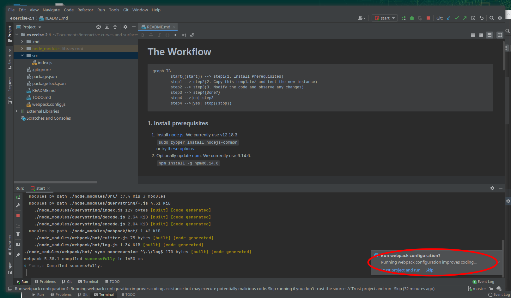

Click on 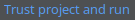:

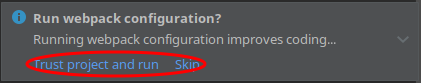

Nothing much visibly happens, but it's a good idea all the same.

Now, scroll `index.js`  until you can see line 15:

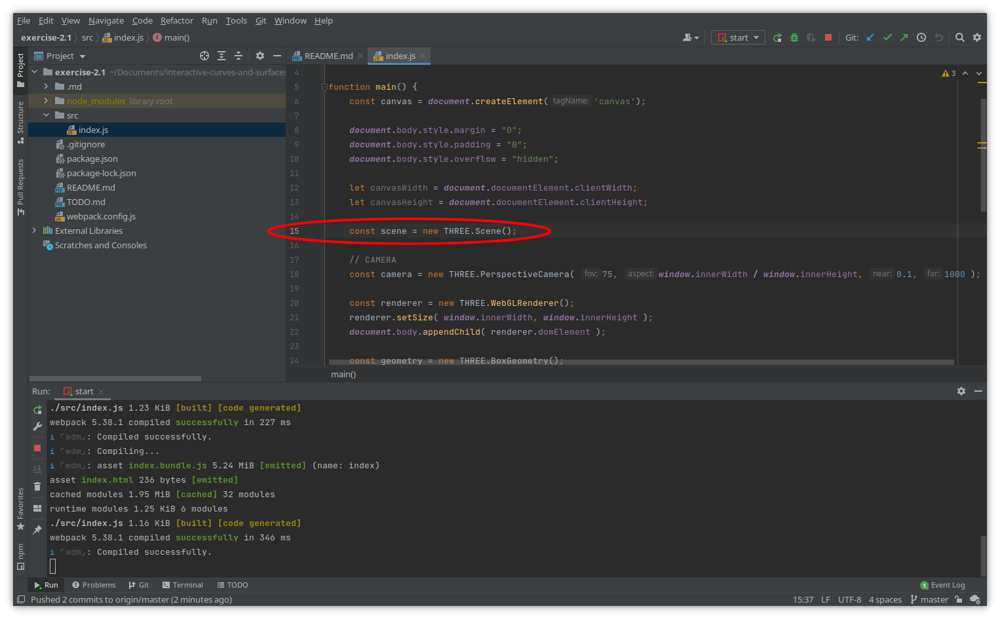

Insert a new line right after this one that starts with `scene.` so that Webstorm's indexing feature displays a drop-down of possible attributes and methods.  You'll see `scene.background` is immediately obvious in the list:

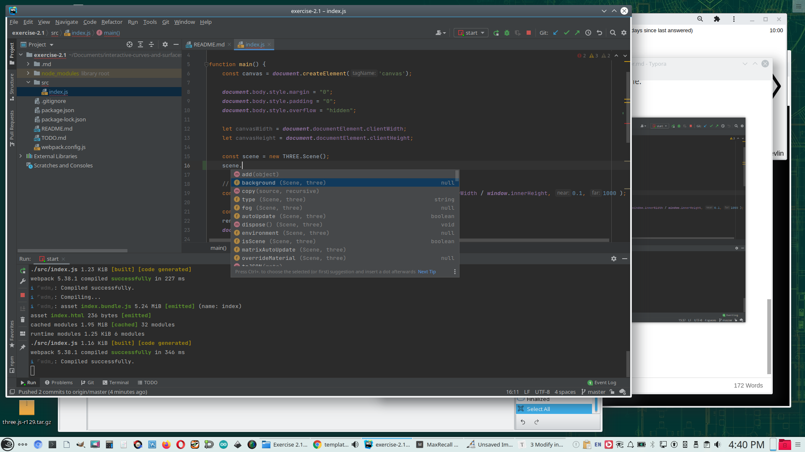

Add line 16 as shown:

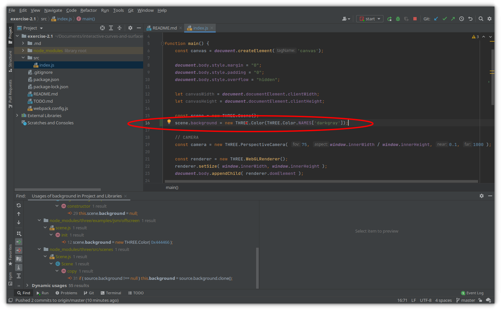

Now click ^S to save the file.

You'll see that webpack detects the change and refreshes the browser, which will look something like this:

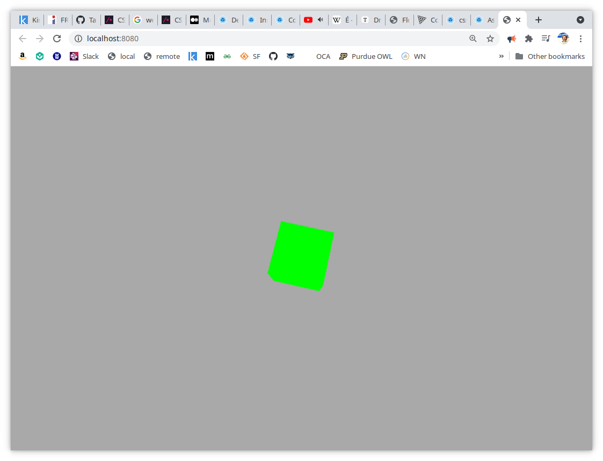

How did we know what type scene.background was?  Well, we didn't really.  

We used ^b to find `scene.background`'s  first occurrence, but that was unhelpful:

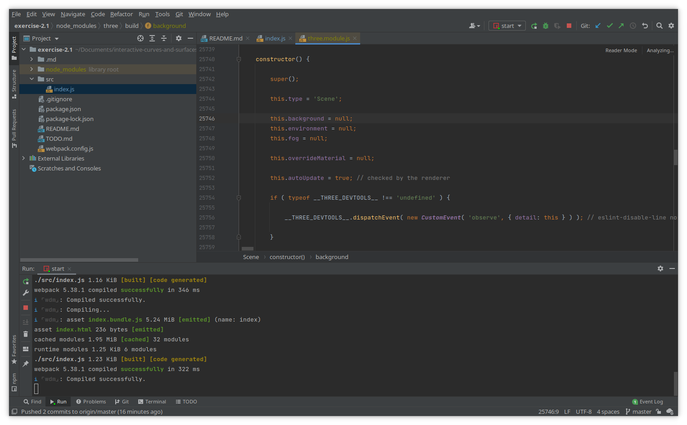

Next we selected 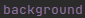and right-clicked to display the drop-down menu item 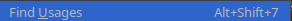:

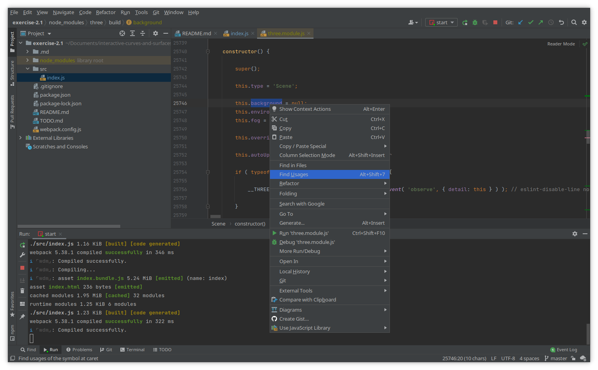

This produced a mass of results:

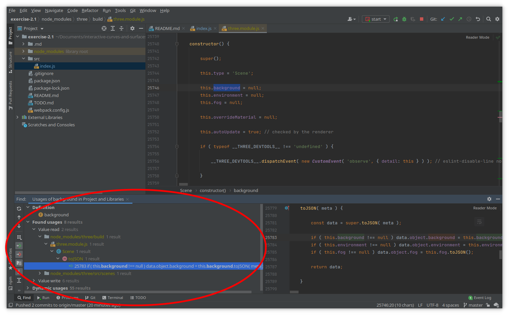

We then expanded the 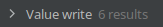.

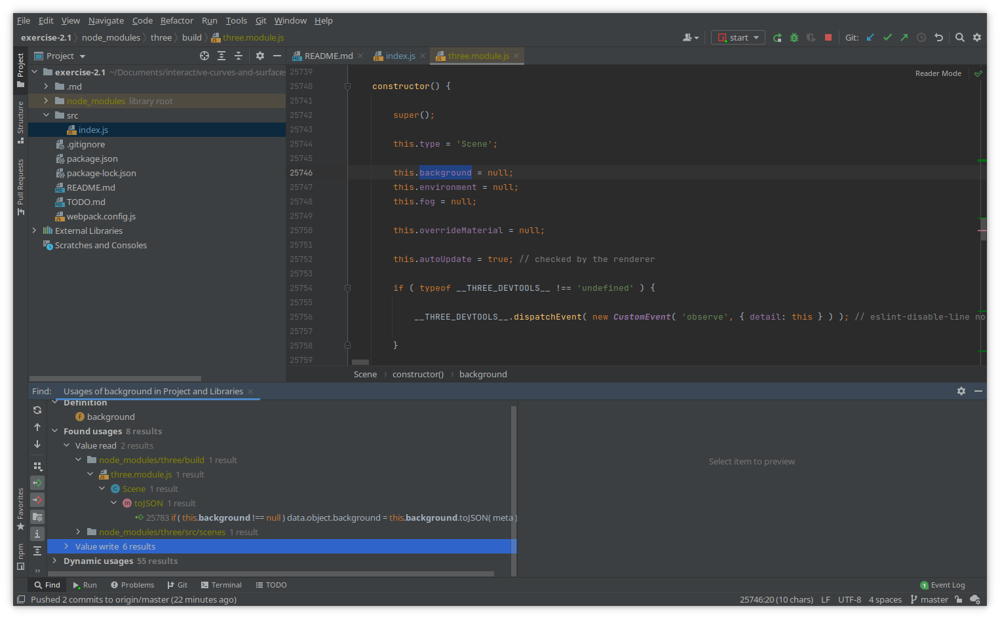

Which gave us:

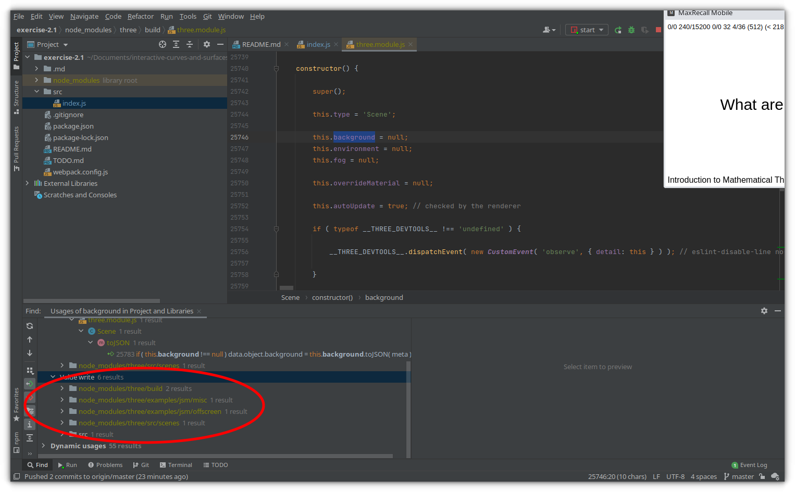

Expanding these resulted in finding a couple that suggested a pattern we might use:

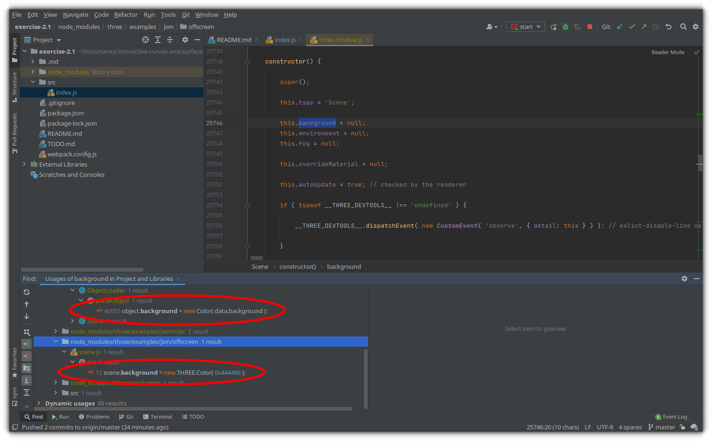

These suggest that scene.background is a THREE.Color() object.

Using this information, we consulted the threejs.org web site's documentation, which is very good, and found this:

How did we find it?

We navigated to threejs.org, and then clicked 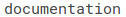 as shown:

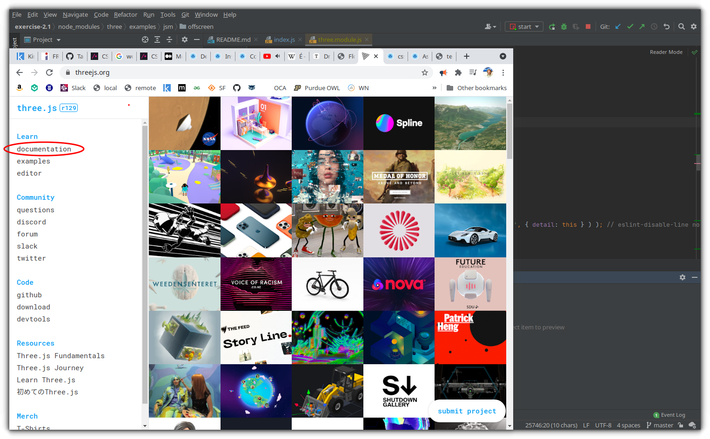

We then clicked in the topics pane on the left to make sure it was selected and used the browser search (^F) to search for instances of the string "Color":

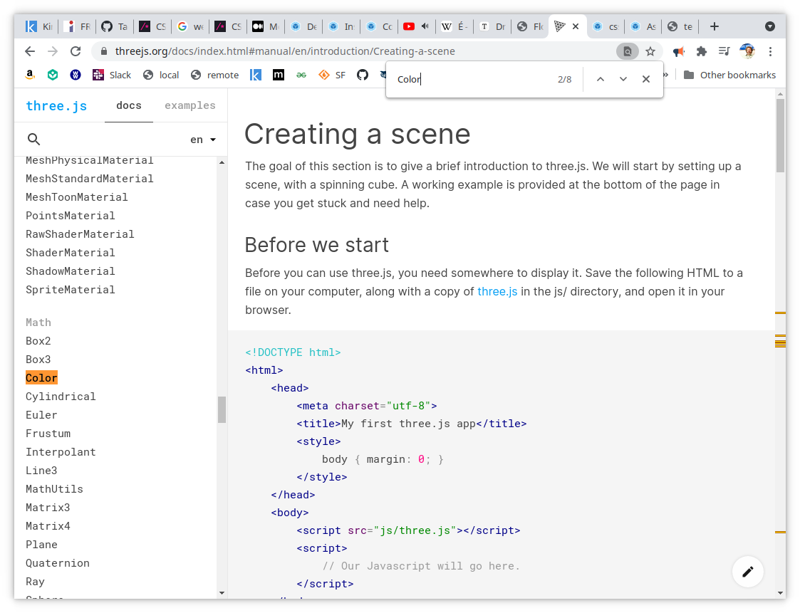

Turns out the second instance was useful, so we clicked it:

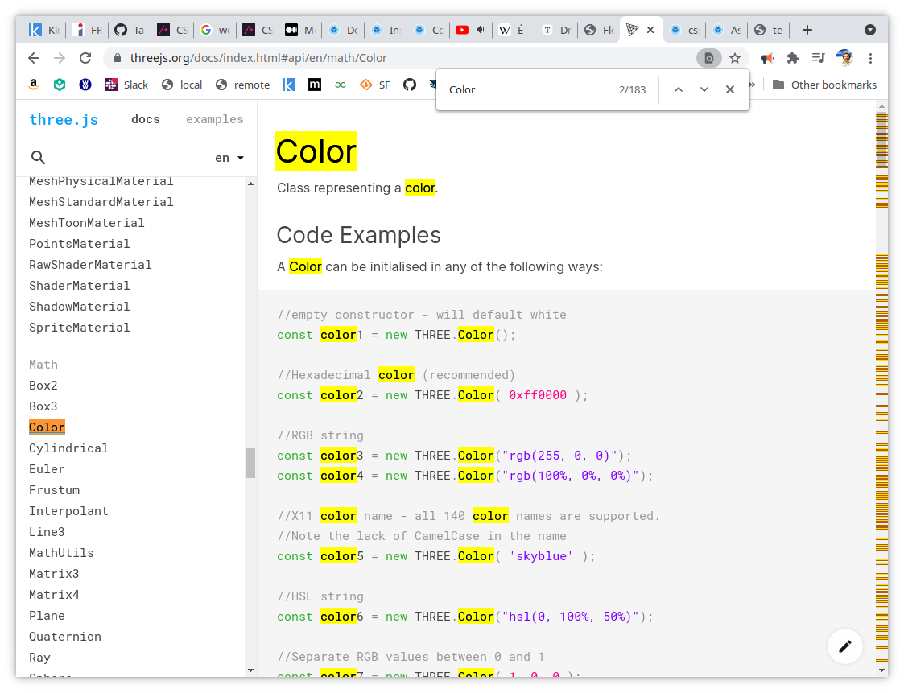

