### Turn off animation temporarily

For now, we're not going to need the cube to be animated, so let's turn it off temporarily by commenting out some lines of code:

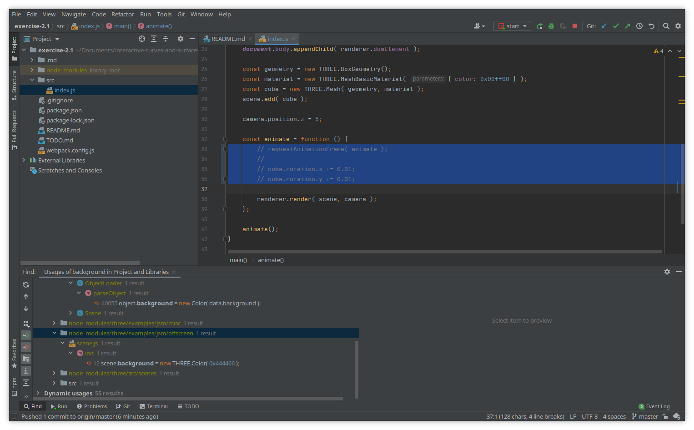

Commit this change using :

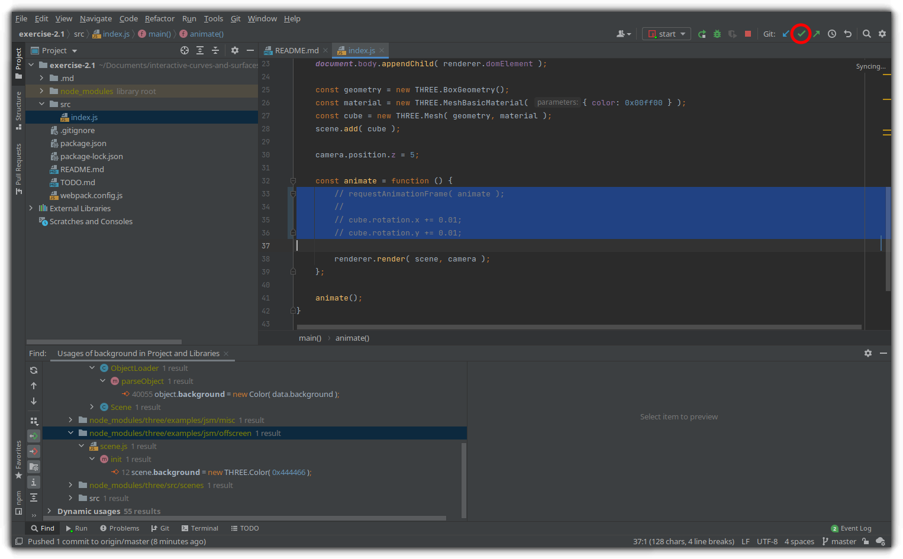

This displays the  dialog: 

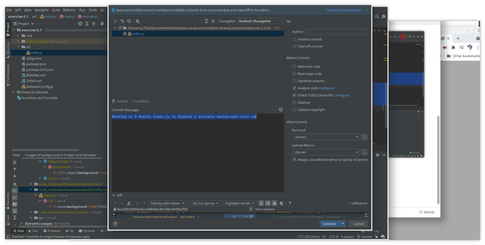

Update 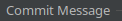:

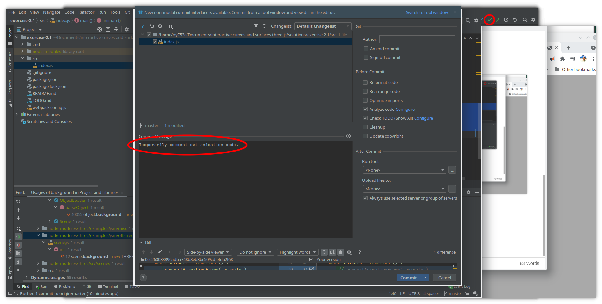

Click 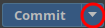to display the drop-down, and then select :

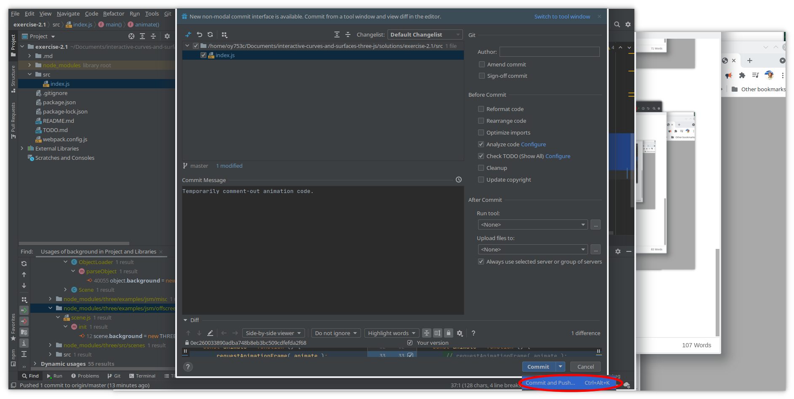

If you see the Code Analysis dialog, select :

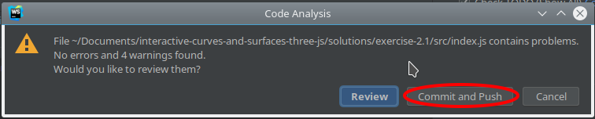

You will see the "Push Commits" dialog:

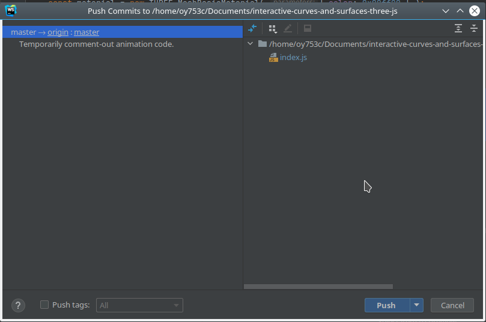

Click :

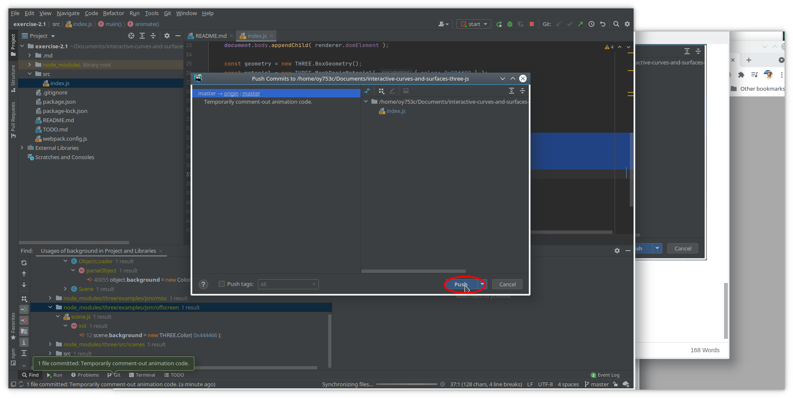

You see the following notification when the commit and push is complete:

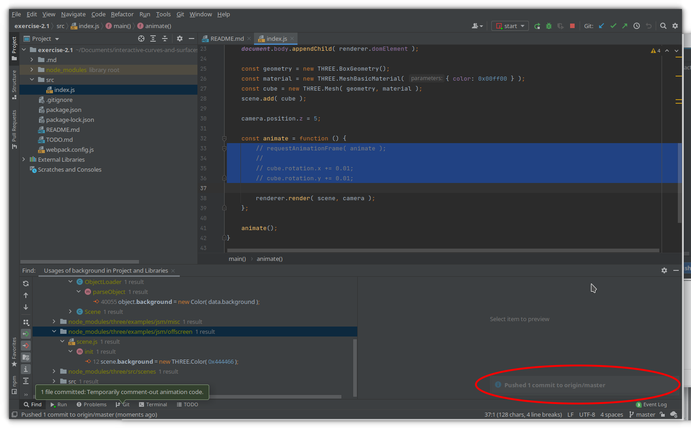

Now turn animation back on, and commit that change as well.

NOTE: Don't forget to turn animation back on, or your tutor may fail your exercise!